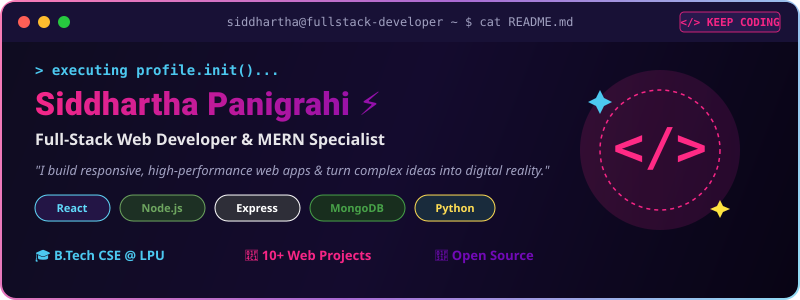
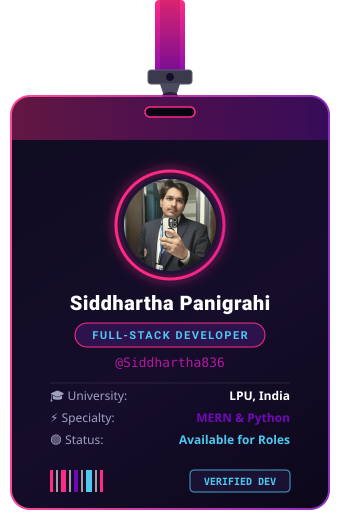
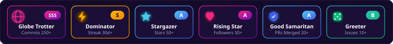

  <!-- Header MacOS Terminal Graphic -->
  

    

  <!-- Profile Quick Badges -->
  

    
    
    
    
    
  

 

<!-- Two-Column Showcase Section: Lanyard Badge (Left) + Featured Projects (Right) -->
<table>
  <tr>
    <td width="38%" align="center" valign="top">
      <!-- Lanyard ID Card Asset with Photo -->
      
    </td>
    <td width="62%" valign="top">
      <h3>🌸 My Featured Creations</h3>
      
<i>Handcrafted web applications &amp; technical software projects:</i>

      <table>
        <thead>
          <tr>
            <th>📌 Project</th>
            <th>🛠️ Tech Stack</th>
            <th>⭐ Category</th>
          </tr>
        </thead>
        <tbody>
          <tr>
            <td><a href="https://github.com/Siddhartha836/Blogging-with-MERN"><b>Blogging-with-MERN</b></a> Full-stack blogging web app with user auth &amp; reactions</td>
            <td><code>MongoDB</code> <code>Express</code> <code>React</code> <code>Node</code></td>
            <td>⭐ <code>Full-Stack</code></td>
          </tr>
          <tr>
            <td><a href="https://github.com/Siddhartha836/Excel-Analytics-Platform"><b>Excel-Analytics-Platform</b></a> Transforms raw Excel datasets into interactive visual charts</td>
            <td><code>JavaScript</code> <code>HTML5</code> <code>Chart.js</code></td>
            <td>📈 <code>Analytics</code></td>
          </tr>
          <tr>
            <td><a href="https://github.com/Siddhartha836/Ai-Pest-Identification-Management"><b>AI-Pest-Identification</b></a> AI agricultural pest detection &amp; plant protection solution</td>
            <td><code>Python</code> <code>AI/ML</code> <code>HTML/CSS</code></td>
            <td>🌾 <code>AI Tech</code></td>
          </tr>
          <tr>
            <td><a href="https://github.com/Siddhartha836/Foodie_Mart"><b>Foodie_Mart</b></a> Online food ordering &amp; restaurant delivery frontend app</td>
            <td><code>HTML5</code> <code>CSS3</code> <code>JavaScript</code></td>
            <td>🍔 <code>E-Commerce</code></td>
          </tr>
          <tr>
            <td><a href="https://github.com/Siddhartha836/doctor-app"><b>doctor-app</b></a> Healthcare booking &amp; doctor appointment platform</td>
            <td><code>JavaScript</code> <code>Node.js</code> <code>Express</code></td>
            <td>🩺 <code>HealthTech</code></td>
          </tr>
          <tr>
            <td><a href="https://github.com/Siddhartha836/FileSystem-Recovery-Optimization"><b>FileSystem-Recovery</b></a> OS-level file backup &amp; automated data recovery engine</td>
            <td><code>Python</code> <code>OS Algorithms</code></td>
            <td>💾 <code>OS System</code></td>
          </tr>
        </tbody>
      </table>
      
<i>"Code is my craft, logic is my superpower." ⚡</i>

    </td>
  </tr>
</table>

 

---

### 🛠️ Tech Stack & Digital Toolkit

  #### 🌐 Languages & Frontend Technologies
  

    
  

  #### ⚙️ Backend, Databases & Cloud Infrastructure
  

    
  

  #### 🔧 Developer Tools & Productivity
  

    
  

---

### 📈 Contribution Graph & GitHub Analytics

  <!-- Glowing Contribution Activity Graph -->
  <h4>💖 Contribution Graph</h4>
  

    

  <!-- Stats & Language Cards (Tested 200 OK Endpoints) -->
  <table border="0" width="100%">
    <tr>
      <td width="50%" align="center">
        
      </td>
      <td width="50%" align="center">
        
      </td>
    </tr>
  </table>

   

  <!-- Streak Stats (Tested 200 OK Demolab Endpoint) -->
  

---

### 🐍 Watch the Snake Eat My Contributions

  

---

### 🏆 Achievements & Badges

  <!-- Custom Vector Rank Badges Bar -->
  

    

  <!-- Real-Time GitHub Stats Card -->
  

    

  <!-- Official GitHub Achievement Badges -->
  

    
    &nbsp;
    
    &nbsp;
    
    &nbsp;
    
    &nbsp;
    
    &nbsp;
    
  

---

### ✍️ Daily Developer Quote

  

---

### 🌐 Let's Connect!

  
  
  
  
  
  
  

    

  <!-- Profile Visitor Counter -->
  

    

  <i>Handcrafted with ❤️ for Siddhartha Panigrahi • B.Tech CSE @ LPU</i>

